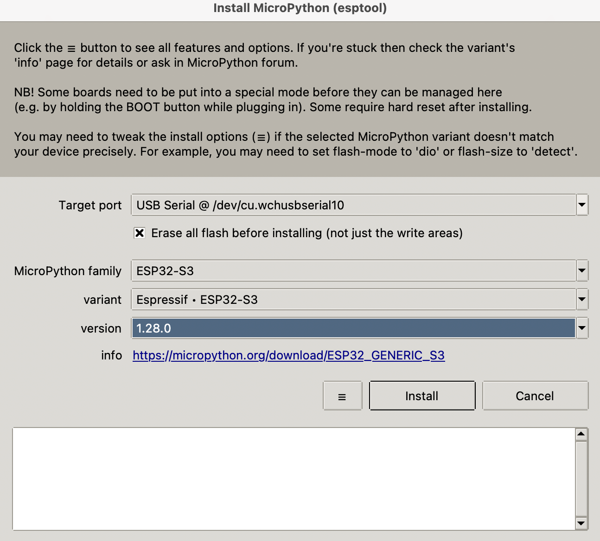

# MicroPython Examples — Lonely Binary 1602 I2C LCD

**Thank you for purchasing the Lonely Binary Liquid Crystal Display Set!** 🎉

Your purchase is what funds tutorials like this one — every example here was written and **tested on a real ESP32-S3 with a real 1602 display**, so you get working code instead of a guess. We genuinely appreciate your support.

← Back to the [main guide](../README.md) for wiring, contrast adjustment and troubleshooting.

---

## What's in here

A numbered, step-by-step tutorial series. Each script teaches **one new idea**, builds on the one before it, and is commented line by line. Start at `00` and work down.

| # | Script | What you'll learn |
| :-- | :------------------------------------------------- | :----------------------------------------------------------------------- |
| — | [`lcd_i2c.py`](lcd_i2c.py)                           | **The driver.** Copy this to your board first — every example imports it  |
| 00 | [`00_i2c_scan.py`](00_i2c_scan.py)                   | Find your display's I2C address — **run this first**                      |
| 01 | [`01_hello_world.py`](01_hello_world.py)             | Setting up I2C and placing text with `set_cursor(column, row)`            |
| 02 | [`02_cursor_and_blink.py`](02_cursor_and_blink.py)   | Cursor, blink, and hiding the text vs. the backlight                      |
| 03 | [`03_counter.py`](03_counter.py)                     | Changing numbers — and fixing the classic "ghost digit" bug               |
| 04 | [`04_scrolling_text.py`](04_scrolling_text.py)       | Three ways to scroll messages longer than 16 characters                   |
| 05 | [`05_custom_characters.py`](05_custom_characters.py) | Design your own 5×8 symbols — hearts, bells, degree signs                 |
| 06 | [`06_shell_to_lcd.py`](06_shell_to_lcd.py)           | Type in the Thonny shell, watch it appear on the LCD                      |
| 07 | [`07_progress_bar.py`](07_progress_bar.py)           | **Capstone** — a smooth 80-step progress bar from custom characters       |
| 08 | [`08_digital_clock.py`](08_digital_clock.py)         | **Capstone** — a flicker-free clock using `ticks_ms()`                    |

---

## Step 1 — Install MicroPython on your ESP32-S3 with Thonny

If your board already runs MicroPython, skip to Step 2.

**1. Install Thonny** from [thonny.org](https://thonny.org) and open it.

**2. Plug your ESP32-S3 into your computer** with a USB cable that carries data (charge-only cables will not work).

**3. Open the installer.** Go to **Tools → Options… → Interpreter**, choose **MicroPython (ESP32)** from the dropdown at the top, then click **"Install or update MicroPython (esptool)"** at the bottom right.

**4. Fill in the dialog** exactly as below:

<p align="center">
  
</p>

| Field | Set it to |
| :--------------------- | :---------------------------------------------------------- |
| **Target port** | Your board — on macOS `/dev/cu.wchusbserial…`, on Windows a `COM` port |
| **Erase all flash** | ✅ Tick it — a clean start avoids a lot of odd problems      |
| **MicroPython family** | `ESP32-S3`                                                   |
| **variant** | `Espressif · ESP32-S3`                                       |
| **version** | The newest offered (this tutorial was tested on `1.28.0`)    |

**5. Click Install** and wait for it to finish. Do not unplug the board.

> **Board not in the port list?** Unplug it, hold the **BOOT** button down, plug it back in while still holding, then release. That forces the download mode the installer needs. Pick the port and try again.

**6. Close the dialog.** The Thonny shell should now show a MicroPython prompt:

```
MicroPython v1.28.0 on ESP32_GENERIC_S3 with ESP32S3
Type "help()" for more information.
>>>
```

---

## Step 2 — Copy the driver to your board

MicroPython has no built-in LCD support, so this folder includes a small driver: **`lcd_i2c.py`**. Every example starts with `from lcd_i2c import LcdI2C`, which only works once that file lives on the board.

In Thonny:

1. Make sure the **Files** panel is visible (**View → Files**)
2. In the top half you'll see your computer's files — find `lcd_i2c.py`
3. **Right-click it → "Upload to /"**

You only have to do this once. The bottom half of the Files panel shows what is on the board — `lcd_i2c.py` should now be listed there.

---

## Step 3 — Wire it up

> ### ⚠️ Use a logic level converter
>
> **This is not optional.** The LCD runs at 5 V and pulls `SDA` and `SCL` up to 5 V. The ESP32-S3 is a 3.3 V device — feeding 5 V into its GPIO pins can **permanently damage it**. It may appear to work at first, then fail later.
>
> Put a **2-channel logic level converter** on `SDA` and `SCL`: LV side to the ESP32-S3 (3.3 V), HV side to the LCD (5 V). Both sides need power and ground.
>
> 🛒 **Lonely Binary 2CH Logic Level Converter:** https://www.amazon.com/dp/B0FFMLDYNY

<p align="center">
  
</p>

The ESP32-S3 can use **almost any free GPIO** for I2C. These examples default to **GPIO 8 for SDA** and **GPIO 9 for SCL**. If you wire it differently, change these lines at the top of each script:

```python
SDA_PIN = 8
SCL_PIN = 9
LCD_ADDR = 0x27
```

---

## Step 4 — Run the examples

Open `00_i2c_scan.py` in Thonny and press **Run** (the green ▶ button, or F5). The shell will report every device it finds:

```
Scanning...
  Device found at 0x27 (39)  <- looks like a 1602 I2C LCD
  Done. 1 device(s) found.
```

If your address is not `0x27`, update `LCD_ADDR` in the scripts. Then work through `01` to `08` in order.

To stop a running script, press the **Stop** button in Thonny or **Ctrl-C** in the shell.

### Want it to run on power-up?

Rename the script to `main.py` and upload it to the board. MicroPython runs `main.py` automatically every time the board is powered on — no computer needed.

---

## Troubleshooting

| Symptom | Likely cause / fix |
| :------------------------------------ | :------------------------------------------------------------------------------- |
| `ImportError: no module named 'lcd_i2c'` | You skipped Step 2 — upload `lcd_i2c.py` to the board                          |
| `OSError: [Errno 19] ENODEV` | Nothing answered on the bus — check wiring and that `SDA_PIN`/`SCL_PIN` are right |
| Scan finds nothing | Check `VCC` (5 V), `GND`, and that `SDA`/`SCL` are not swapped. Confirm the level converter is powered on **both** sides |
| Backlight on, but no text | Adjust the contrast trimmer — gently, it has about one turn of travel            |
| Solid blocks on screen | Same thing: contrast. See the [main guide](../README.md#contrast-adjustment-fix-blank-or-block-characters) |
| Board missing from the port list | Hold **BOOT** while plugging the USB cable in                                    |

---

## Support

Made with ❤️ by **Lonely Binary** — *From Zeros to Heroes, One Bit at a Time.*

If a script doesn't behave, check the [Troubleshooting table](../README.md#troubleshooting) in the main guide first — the vast majority of issues are contrast, address, or wiring rather than code.
