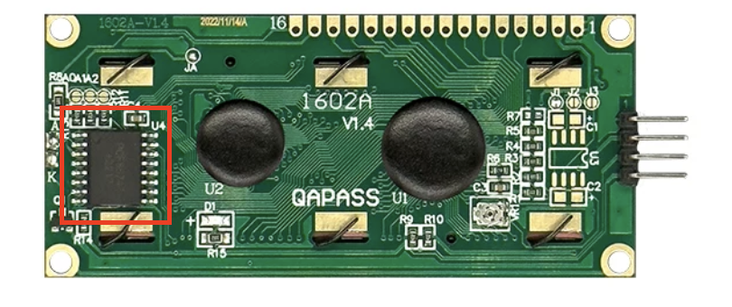
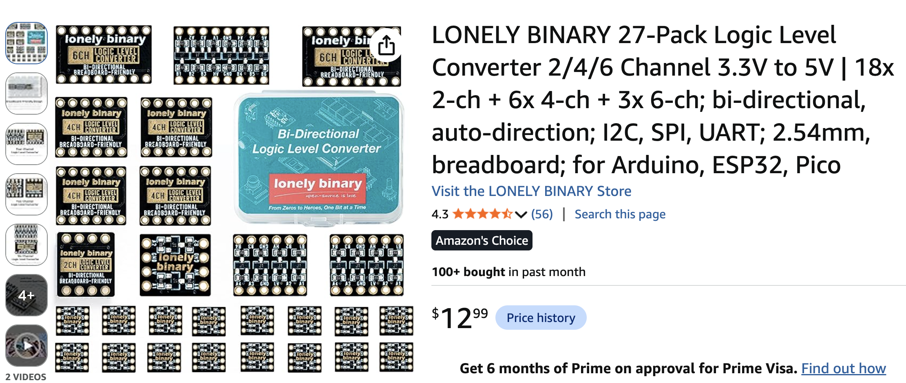
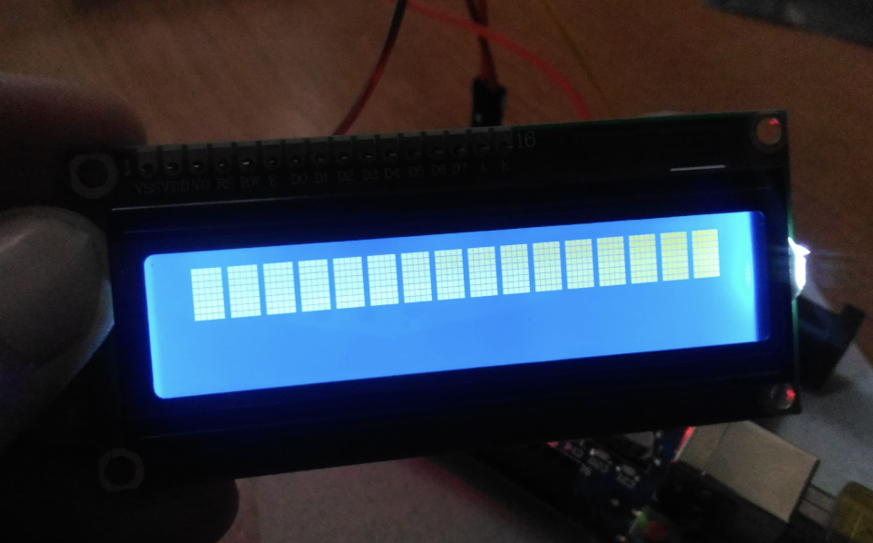
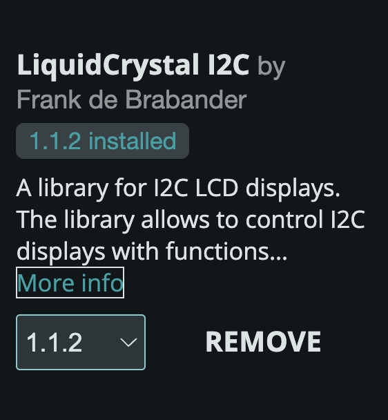
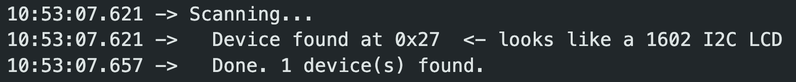

# Lonely Binary 1602 I2C LCD Display

Thank you for purchasing the **Lonely Binary Liquid Crystal Display Set**. This 16×2 character LCD ships with the I2C interface **built directly onto the board** — no bulky add-on backpack required — giving you a sleeker, lower-profile display that talks to your microcontroller over just two data wires.

This guide covers wiring, contrast adjustment, the recommended Arduino library, and a ready-to-run example sketch.

---

## Highlights

- **16×2 character display** (1602A) with a crisp, backlit screen
- **Built-in I2C interface** — the I2C controller is integrated on the PCB, not a separate soldered-on backpack
- **Only 4 wires** to connect: `VCC`, `GND`, `SDA`, `SCL`
- **On-board contrast trimmer** for fine-tuning readability
- Works great with Arduino, and with 3.3 V boards when paired with a logic level converter (see below)

---

## Integrated I2C — No Add-On Backpack

Unlike traditional character LCDs that require a separate I2C "backpack" module soldered to the 16-pin header, the Lonely Binary LCD has the **I2C function built right into the board**. The highlighted chip below is the on-board I2C controller — this is what keeps the module slim and easy to wire.

<p align="center">
  
</p>

---

## Wiring

The LCD exposes a simple 4-pin I2C header:

| LCD Pin | Connect To            | Notes                                  |
| :------ | :-------------------- | :------------------------------------- |
| `GND`   | Ground                | Common ground with your MCU            |
| `VCC`   | **5 V**               | The LCD is a 5 V device — see below    |
| `SDA`   | I2C data              | e.g. Arduino UNO `A4`                   |
| `SCL`   | I2C clock             | e.g. Arduino UNO `A5`                   |

### ⚠️ 5 V Operation & 3.3 V Microcontrollers

**This LCD is designed to run at 5 V.** On the board, the `SDA` and `SCL` lines are pulled up to 5 V.

If you are using a **3.3 V microcontroller** — such as an **ESP32, ESP32-S3, or Raspberry Pi Pico** — those 5 V signals can exceed what the MCU's GPIO pins are rated to accept. In the short term the board may appear to work fine, but over the long term the 5 V level on the I2C lines can **permanently damage** your ESP32-S3 or similar 3.3 V board.

To protect your microcontroller, we strongly recommend placing a **Lonely Binary 2-Channel Logic Level Converter** between the 3.3 V MCU and the 5 V LCD on the `SDA` and `SCL` lines.

> 🛒 **Lonely Binary 2CH Logic Level Converter:** https://www.amazon.com/dp/B0FFMLDYNY

<p align="center">
  
</p>

---

## Contrast Adjustment (Fix Blank or "Block" Characters)

When you first power up the display, you may see **solid blocks**, extremely faint text, or nothing at all. This is almost always a **contrast** setting — not a fault.

<p align="center">
  
</p>

To fix it, use a small screwdriver to gently turn the **contrast potentiometer** (the tiny blue trimmer on the board) until the characters become clear.

> ⚠️ **Important:** The trimmer has a very limited travel of roughly **one turn only**. Turn it **slowly and gently** — do **not** force it past its stop. The pot is delicate and can be easily damaged by over-turning.

---

## Arduino IDE Setup

For the Arduino IDE, we recommend the **`LiquidCrystal I2C`** library by **Frank de Brabander**.

1. Open the Arduino IDE
2. Go to **Sketch → Include Library → Manage Libraries…** (or click the Library Manager icon)
3. Search for **`LiquidCrystal I2C`**
4. Select the library by **Frank de Brabander** and click **Install**

<p align="center">
  
</p>

---

## Example Sketch — Hello, World!

Once the library is installed, upload the sketch below. Most of these modules use I2C address **`0x27`** (some use `0x3F`).

```cpp
#include <Wire.h>
#include <LiquidCrystal_I2C.h>

// Set the LCD I2C address (0x27 is most common; try 0x3F if nothing shows)
// 16 columns, 2 rows
LiquidCrystal_I2C lcd(0x27, 16, 2);

void setup() {
  lcd.init();        // initialize the LCD
  lcd.backlight();   // turn on the backlight

  lcd.setCursor(0, 0);
  lcd.print("Lonely Binary");
  lcd.setCursor(0, 1);
  lcd.print("Hello, World!");
}

void loop() {
  // nothing to do here
}
```

> 💡 This same sketch lives in [`Arduino/01_Hello_World`](Arduino/01_Hello_World), fully commented — and it's the first step of a [step-by-step tutorial series](#step-by-step-arduino-examples) that takes you from here to a working progress bar and clock.

---

## Find Your I2C Address

Most of these modules use address **`0x27`**, but some use **`0x3F`**. If the backlight comes on but no text appears — and the contrast is already adjusted — you are most likely talking to the wrong address.

Rather than guess, **run the I2C scanner**. Ready-to-run versions are included in this repository:

| Folder         | File                          | Runs on                                            |
| :------------- | :---------------------------- | :------------------------------------------------- |
| `Arduino/`     | `00_I2C_Scanner/00_I2C_Scanner.ino` | Arduino UNO / Nano / Mega **and** ESP32-S3 / ESP32 |
| `MicroPython/` | `00_i2c_scan.py`                    | ESP32-S3 / ESP32 / Raspberry Pi Pico               |

### Run it on Arduino

1. Open **`Arduino/00_I2C_Scanner/00_I2C_Scanner.ino`** in the Arduino IDE
2. *(ESP32 only)* Set your wiring at the top of the sketch — any free GPIO works:
   ```cpp
   #define I2C_SDA_PIN 8
   #define I2C_SCL_PIN 9
   ```
3. Select your board and port, then click **Upload**
4. Open **Tools → Serial Monitor** and set the baud rate:
   - **9600** for Arduino UNO
   - **115200** for ESP32-S3

> The same sketch works on both boards — it detects the target at compile time and picks the right pins and baud rate for you. On the UNO it uses the fixed `A4` / `A5` pins; on the ESP32 it uses the GPIOs you defined above.

The scanner re-scans every 5 seconds. When it finds your display you will see:

<p align="center">
  
</p>

That's your address. Now update the "Hello, World!" sketch to match:

```cpp
LiquidCrystal_I2C lcd(0x27, 16, 2);   // <- change 0x27 to the address you found
```

### Run it on MicroPython

1. Copy **`MicroPython/00_i2c_scan.py`** to your board (Thonny, `mpremote`, or your editor of choice)
2. Set the pins near the top of the file to match your wiring:
   ```python
   SDA_PIN = 8
   SCL_PIN = 9
   ```
3. Run it — with `mpremote` that's simply:
   ```bash
   mpremote run MicroPython/00_i2c_scan.py
   ```

You'll get the same result, printed to the REPL.

> 🐍 New to MicroPython? The [`MicroPython/` folder](MicroPython) has a full guide to installing the firmware with Thonny, plus its own step-by-step tutorial series.

### "No I2C devices found"

If the scan comes back empty, it's a wiring problem rather than an address problem — check `VCC` (5 V), `GND`, and that `SDA` and `SCL` are not swapped. On a 3.3 V board, also confirm your logic level converter is powered on **both** sides.

---

## Step-by-Step Arduino Examples

Got text on the screen? Great — now learn what else this display can do. The `Arduino/` folder contains a numbered tutorial series. Each sketch teaches **one new idea**, builds on the one before it, and is commented line by line.

Work through them in order:

| # | Sketch | What you'll learn |
| :-- | :--------------------------------------------------- | :---------------------------------------------------------------------------- |
| 00 | [`00_I2C_Scanner`](Arduino/00_I2C_Scanner)             | Find your display's I2C address (start here if nothing shows up)               |
| 01 | [`01_Hello_World`](Arduino/01_Hello_World)             | `init()`, `backlight()`, and placing text with `setCursor(column, row)`        |
| 02 | [`02_Cursor_And_Blink`](Arduino/02_Cursor_And_Blink)   | The underline cursor, the blinking block, and hiding the text vs. the backlight |
| 03 | [`03_Counter`](Arduino/03_Counter)                     | Displaying changing numbers — and fixing the classic "ghost digit" bug          |
| 04 | [`04_Scrolling_Text`](Arduino/04_Scrolling_Text)       | Three ways to scroll messages longer than 16 characters                        |
| 05 | [`05_Custom_Characters`](Arduino/05_Custom_Characters) | Design your own 5×8 symbols — hearts, bells, degree signs                      |
| 06 | [`06_Serial_To_LCD`](Arduino/06_Serial_To_LCD)         | Type in the Serial Monitor, watch it appear on the LCD                         |
| 07 | [`07_Progress_Bar`](Arduino/07_Progress_Bar)           | **Capstone** — a smooth 80-step progress bar built from custom characters      |
| 08 | [`08_Digital_Clock`](Arduino/08_Digital_Clock)         | **Capstone** — a flicker-free clock using `millis()` and `snprintf()`          |

### Before you upload

Every sketch assumes address **`0x27`**. If [your scan](#find-your-i2c-address) reported something else, change this line at the top of the sketch:

```cpp
LiquidCrystal_I2C lcd(0x27, 16, 2);   // <- your address here
```

### Using an ESP32-S3?

The tutorial sketches are written for the Arduino UNO to keep them easy to read. To run one on an ESP32, uncomment the `Wire.begin()` line in `setup()` and set your own GPIOs:

```cpp
void setup() {
  Wire.begin(8, 9);   // <- your SDA, SCL

  lcd.init();
  ...
```

> ⚠️ That line **must come before `lcd.init()`**. The library calls `Wire.begin()` internally with no pins, so if you initialise the bus first your pin choice is kept — do it the other way round and your GPIOs are ignored.

Sketches that print to the Serial Monitor use **9600** baud.

---

## Troubleshooting

| Symptom                              | Likely Cause / Fix                                                                 |
| :----------------------------------- | :--------------------------------------------------------------------------------- |
| Solid blocks or blank screen         | Adjust the **contrast** trimmer (see above) — gently, ~1 turn max                  |
| Backlight on, but no text            | Wrong I2C address — run the [**I2C scanner**](#find-your-i2c-address) and update the address in your sketch |
| Nothing at all / no backlight        | Check `VCC` (5 V) and `GND` wiring                                                 |
| Garbled characters on a 3.3 V board  | Add a **logic level converter** on `SDA`/`SCL` (see 5 V Operation above)           |

---

## Specifications

| Item              | Detail                                  |
| :---------------- | :-------------------------------------- |
| Display           | 1602A, 16 characters × 2 lines          |
| Interface         | I2C (built-in, integrated on PCB)       |
| Operating voltage | 5 V                                     |
| I2C address       | 0x27 (typical) or 0x3F                   |
| Contrast          | On-board single-turn trimmer            |

---

## Support

Made with ❤️ by **Lonely Binary** — *From Zeros to Heroes, One Bit at a Time.*

If you run into any issues, double-check the wiring and contrast first, then reach out through your point of purchase for assistance.
